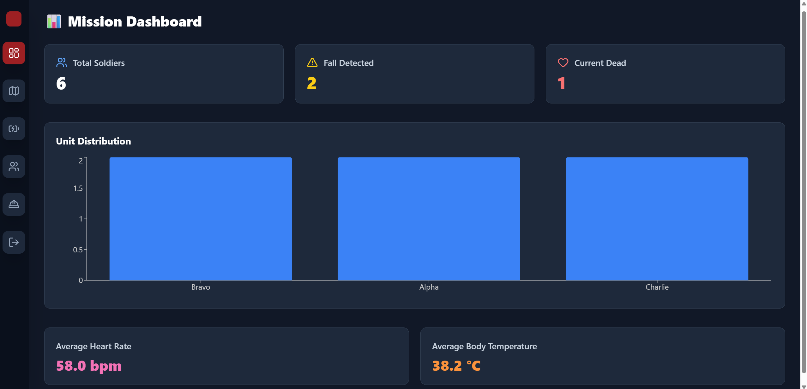
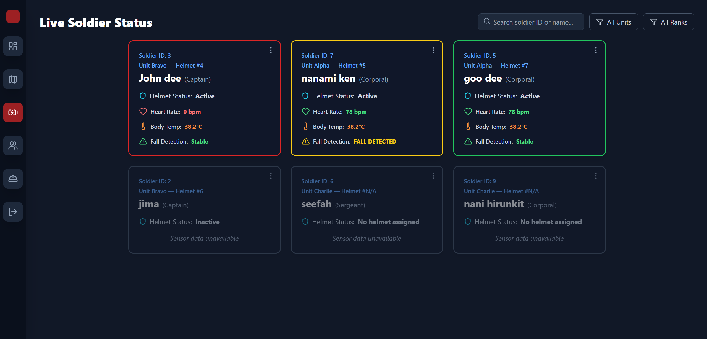
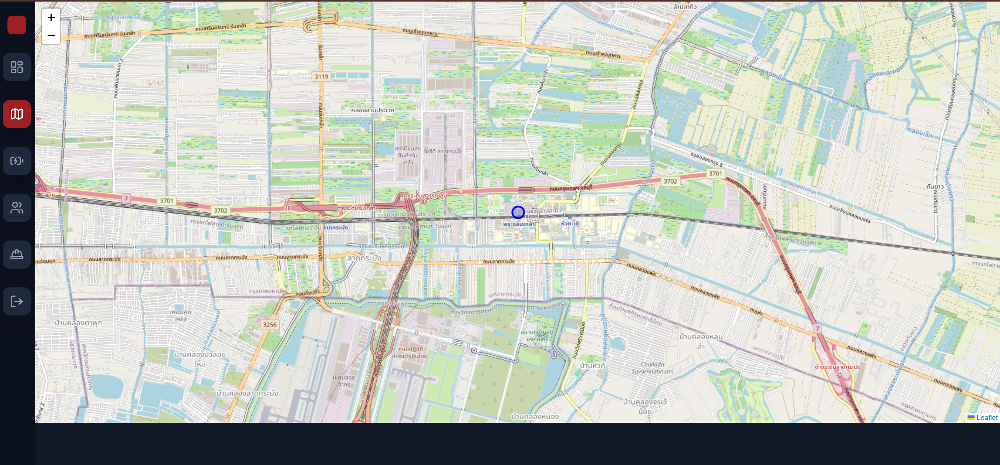
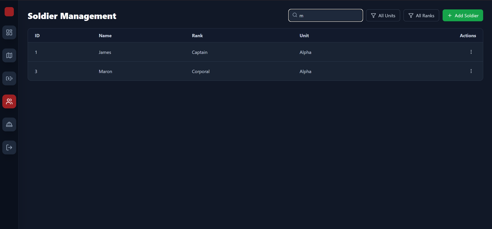
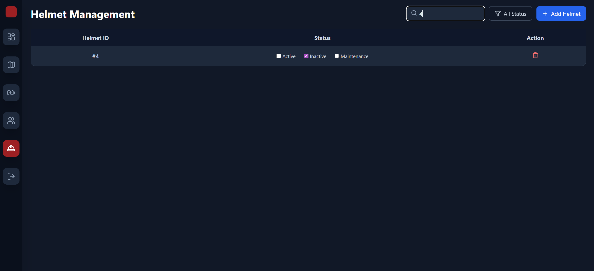

# LONG-RANGE PERSONNEL VITALITY & LOCATION TRACKING SYSTEM
KMITL 4th Year Software Engineering Senior Project

## Introduction
LONG-RANGE PERSONNEL VITALITY & LOCATION TRACKING SYSTEM is a senior project developed as part of the 4th year Software Engineering curriculum at King Mongkut’s Institute of Technology Ladkrabang (KMITL).

The project focuses on long-range wireless communication using LoRa technology to enable real-time data transmission between embedded devices, backend services, and monitoring applications. The system integrates firmware, server infrastructure, backend APIs, and client applications into a complete IoT communication platform.

The goal of the project is to explore reliable low-power communication systems and analyse LoRa performance across different environments through practical deployment and testing.

## Features

- LoRa Communication
  - Long-range wireless communication using LoRa modules
  - Real-time data transmission
  - Low-power communication system
- Firmware
  - Embedded device integration
  - Wireless packet transmission
  - Communication handling
- Backend & Server
  - API communication
  - Data processing and management
  - Device connectivity support
- Client Application
  - Monitor transmitted data
  - Visualize communication results
  - User-friendly interface

## Demo

## License

This project is licensed under the terms of the MIT license.
